# ArkhamBench

A rules-enforcing engine + CLI harness that lets LLM agents play *Arkham Horror: The Card
Game* solo — "The Gathering" and "Return to The Gathering" (Night of the Zealot, Part I)
with any of the five core-set investigators — inside coding-agent harnesses, with a
persistent, compactable notebook. Built to reproduce Epoch AI's [EBR-Bench
continual-learning experiments](https://epoch.ai/publications/earthborne-rangers-benchmark) with AHLCG.

- `DESIGN.md` — full architecture & rules-scope spec
- `./ahlcg` — the game CLI (see `docs_agent/playing_guide.md`)
- `docs_agent/` — documents given to playing agents (rules reference, playing guide)
- `data/` — vendored card data (arkhamdb-json-data) + decklists
- `runs/` — game run directories (gitignored)
- `tests/` — `python3 -m unittest discover -s tests`

## Quickstart

```
./ahlcg new --run runs/mygame --seed 7    # set up The Gathering (Roland, standard)
./ahlcg new --run runs/mygame2 --scenario return_to_the_gathering --investigator agnes
./ahlcg state                             # the board
./ahlcg do 3                              # pick option 3; prints events + next decision
./ahlcg score                             # final result once GAME OVER
python3 -m unittest discover -s tests     # engine test suite (144 tests)
python3 -m arkham.fuzz --games 100 --scenario return_to_the_gathering --investigator wendy
scripts/play_demo.sh claude-sonnet-5 my-demo 7   # let an agent play a full game
python3 scripts/bench.py --agent claude-sonnet-5 --label mybench --games 10
# ^ benchmark: Return to The Gathering, investigators rotate roland,daisy,skids,
#   agnes,wendy per game (same order+seeds for every agent), per-label notebook
```

Decks are killbray's ["Better Starter Decks"](https://arkhamdb.com/decklist/view/33937/better-starter-decks-roland-banks-1.0)
(30 cards + 2 signatures + a fixed basic weakness, revised-core pool), vendored in
`data/decks/killbray/`.

## Watching a game

```
scripts/view.sh bench/sonnet5-mini
open http://localhost:8765/viewer/
```

`scripts/view.sh` exports any passed bench or run directories that are not already in
`viewer/data/`, rebuilds the viewer index, caches card images, and serves the static UI
from the repo root. The viewer steps through every decision of a run: location map with
card art, player board, event ticker, the decision presented with the agent's choice
highlighted, and double-sided card modals.

**Live viewer:** https://clydeiii.github.io/arkhambench/ — redeploy with
`scripts/deploy_pages.sh` after exporting new runs.

## Scoring

Reported per run in `result.json`, alongside the raw dimensions (track them all —
composite score is for the benchmark's single number, the dimensions are for analysis):

- **XP** — per the campaign guide: victory display total + resolution bonuses
  (+2 insight in most outcomes; +1 extra for the lead in R2; 0 if killed by agenda-out
  at act ≤ 2).
- **Trauma** — defeat trauma (physical/mental by cause), resolution trauma (R1's burned
  house), Cover Up's game-end trauma.
- **Lita Chantler earned?** — per the campaign guide she joins the campaign in every
  outcome except R2 (she never needs to enter play), so she is tracked as a campaign
  dimension rather than scored.
- **Resolution reached**, victory points, rounds, damage/horror per round, tests
  passed/failed, etc.

**Score = max(0, XP − trauma)**; killed by the agenda while still trapped (R3) scores 0.
(An earlier formula added +3 for Lita; dropped once the campaign guide confirmed she is
earned in all outcomes but R2 regardless of play.)

## Wave 7 — the fully-instrumented campaign wave (2026-07-20/21)

Six subscription-tier frontier models, five full Return to Night of the Zealot
campaigns each (seeds 9401–9405, engine at 429 tests), with — for the first
time — **complete per-session telemetry**: thinking level, tokens, wall-clock
time, and API-equivalent cost. Claude lanes ran via the claude CLI
(harness-default adaptive thinking); GPT-5.6 lanes ran via codex at
**reasoning effort high** (which, we can now confirm, is what every prior
codex wave used too). Costs are what the tokens *would* bill at July-2026 API
list prices — both harnesses actually ran on subscriptions.

| Model (harness) | Thinking | R/D/S/A/W | **Total** | Wall clock | Tokens | API-equiv cost |
|---|---|---|---:|---:|---:|---:|
| **GPT-5.6 Sol** (codex) | high | 5/3/5/3/4 | **20** | 2.2 h | 2.9 M | **$2.22** |
| GPT-5.6 Terra (codex) | high | 5/3/1/4/3 | **16** | 1.1 h | 2.8 M | $1.10 |
| GPT-5.6 Luna (codex) | high | 8/2/0/2/3 | **15** | 1.1 h | 3.1 M | $0.46 |
| Fable 5 (claude) | adaptive | 5/1/1/2/3 | **12** | 4.9 h | 80.2 M | $134.15 |
| Opus 4.8 (claude) | adaptive | 4/1/0/1/5 | **11** | 6.9 h | 99.9 M | $96.55 |
| Sonnet 5 (claude) | adaptive | 1/2/1/3/2 | **9** | 2.5 h | 173.4 M | $70.32 |
| Kimi K3 (opencode) | provider default | 1/1/2/4/3 | **11** | 8.6 h | 90.5 M | $42.61* |
| Hunyuan 3 (opencode) | provider default | 4/1/0/1/2 | **8** | 3.4 h | 59.2 M | $3.91* |

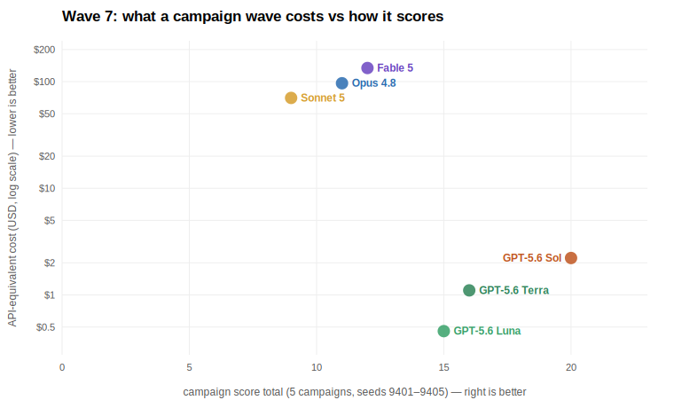
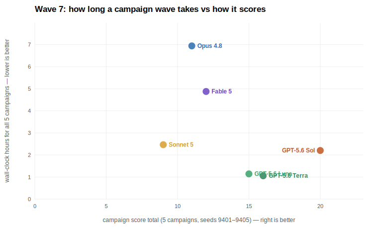

**The GPT-5.6 family swept the podium — at 1–2% of the cost.** Sol's 20 is
the best campaign wave any model has posted on the modern engine, and it
spent $2.22 of API-equivalent tokens doing it; Fable 5, the long-standing
gauntlet champion, scored 12 for $134. The token gap is structural, not just
behavioral: the claude harness re-reads its full context every tool call
(80–173 M mostly-cached tokens), while codex's compaction keeps whole
campaigns under ~3 M. But the scoreboard gap is real — same engine, same
seeds, same prompts. Luna's Roland 8 is the single best campaign of the wave.

**The China lanes joined a day later** (OpenRouter budget cap raised) with
*measured* costs — actual OpenRouter billing summed per message, not list-price
estimates (marked \*). Kimi K3 tied Opus 4.8's score at less than half the
API-equivalent price but was the slowest lane on the board (8.6 h — heavy
per-move deliberation); Hunyuan 3, no longer free but nearly so, delivered 8
points for $3.91. Neither touches the GPT-5.6 frontier: Luna gets K3's score
plus four for one percent of K3's spend.

Telemetry notes: costs for claude lanes are the CLI's own `total_cost_usd`
(list-price recompute agrees within ~8%); codex costs are computed from the
per-session input/cached/output/reasoning split in codex's session logs at
$5/$30 (Sol), $2.50/$15 (Terra), $1/$6 (Luna) per Mtok with cached input at
0.1×. Sonnet 5 priced at intro $2/$10. Raw per-session rows:
`logs/show3-telemetry.jsonl`; aggregator: `scripts/wave7_report.py`.
Cross-wave caveat: prior waves (b4/w6) ran older engines; within-wave
comparisons are the controlled ones. The hy3 + K3 lanes' combined real-dollar cost, including probes: $43.84.

## Benchmark results — main run (2026-07-05)

**Setup:** four agents, ten games each, *Return to The Gathering* on Standard,
identical seeds (1001–1010) and an identical interleaved investigator rotation
(Roland, Daisy, Skids, Agnes, Wendy — twice through). Each agent has a persistent
per-agent notebook as its only cross-game memory, starting empty. The headline metric
is the **final-20% average** (games 9–10), per EBR-Bench methodology. All 40 games ran
on a single frozen engine version, and every game is step-through browsable in the
[live viewer](https://clydeiii.github.io/arkhambench/).

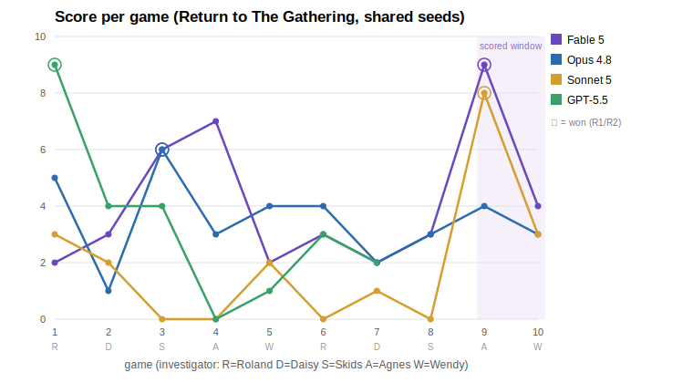

| Agent (harness) | Scores by game | Mean | **Final-20%** | Wins |
|---|---|---:|---:|---|
| Fable 5 (claude) | 2 3 6 7 2 3 2 3 **9** 4 | 4.10 | **6.50** | R1 g3, R2 g9 |
| Sonnet 5 (claude) | 3 2 0 0 2 0 1 0 **8** 3 | 1.90 | **5.50** | R2 g9 |
| GPT-5.5 (codex) | 9 4 4 0 1 3 2 6 **5** 3 | 3.70 | **4.00** | R2 g1, R2 g8 |
| Opus 4.8 (claude) | 5 1 6 3 4 4 2 3 4 3 | 3.50 | **3.50** | R1 g3 |

### Do models actually get better across ten games?

Mostly **no** — at this scale, per-game variance dominates any learning signal. We
measure the trend three ways, because the naive way is confounded: with the
interleaved rotation, game index is correlated with *which investigator* is being
played (game 4 is always Agnes), so a raw score-vs-game trend partly measures roster
difficulty, not learning.

1. **OLS slope** of score vs game index (descriptive trend).
2. **Spearman rank correlation** (robust to the score's outliers).
3. **Paired second-visit delta** — for each investigator, second play minus first
   play (five matched pairs per agent). This is the cleanest learning measure: same
   investigator and deck, richer notebook, different seed.

| Agent | Slope /game | Spearman ρ | Paired Δ (2nd − 1st visit) |
|---|---:|---:|---:|
| Fable 5 | +0.19 | +0.29 | **+0.20** (R +1, D −1, S −3, A +2, W +2) |
| Sonnet 5 | +0.26 | +0.18 | **+1.00** (R −3, D −1, S 0, A +8, W +1) |
| Opus 4.8 | −0.09 | −0.24 | **−0.60** (R −1, D +1, S −3, A +1, W −1) |
| GPT-5.5 | −0.18 | −0.11 | **+0.20** (R −6, D −2, S +2, A +5, W +2) |

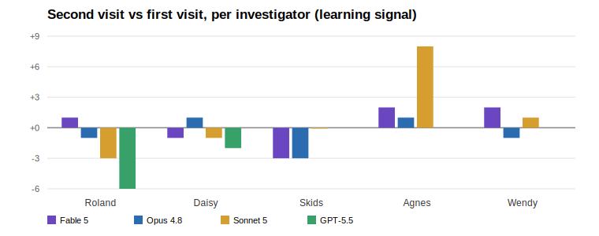

Honest reading of n=10 runs:

- **No agent shows consistent improvement.** Fable's positive slope is real but
  small; Opus is flat-to-declining; Sonnet's +1.00 paired delta is carried entirely
  by one game (its Agnes going 0 → 8) — remove that pair and its delta is −0.75.
- **Notebooks transport recipes, not skill.** Six wins across 40 games, and the
  pattern is plans, not general improvement: both Claude scored-window wins executed
  a Priest-kill-then-R2 line their notebooks had described, and GPT-5.5's game-8 win
  re-ran the kill it had already proven. Average play quality did not rise for any
  agent; specific successful lines *did* replay. Models learn **recipes**, not
  **skill** — at least in ten games.
- **Cold-start capability ≠ learning.** GPT-5.5's opening game (a 9-point R2 win
  with an empty notebook) is the single best game of the benchmark — and drives its
  *negative* slope, since nothing after matched it. Its paired second-visit delta is
  actually +0.20 (identical to Fable's): its play held steady while its hot start
  made the trend line fall. High game-1 skill and positive learning curves are
  independent axes, and this benchmark separates them.
- **Shared seeds make capability gaps legible.** On seed 1003 (Skids), Fable and
  Opus independently found the same R1 kill line (both scored 6 in 16 rounds);
  Sonnet scored 0 on identical draws.
- **Caveats:** 10 games is underpowered for slopes on a 0–9 score with this variance;
  the 2-game scored window is sensitive to single conversions (it's why Sonnet's
  headline beats Opus's despite a 1.6-point worse mean). The 30-game version of this
  run is the obvious next step.

## Benchmark results — open-weights run (2026-07-08)

The same 10-game gauntlet (identical seeds 1001–1010, identical investigator
rotation, empty starting notebooks) run for four Chinese open-weights models via
OpenRouter + the opencode harness. One caveat for cross-table comparison: these
games ran on the current engine, ~30 confirmed rules fixes after the main run
(most fixed bugs were pro-player), with confirmation prompts disabled to match
main-run conditions. Comparisons across the two tables are indicative, not
strictly controlled.

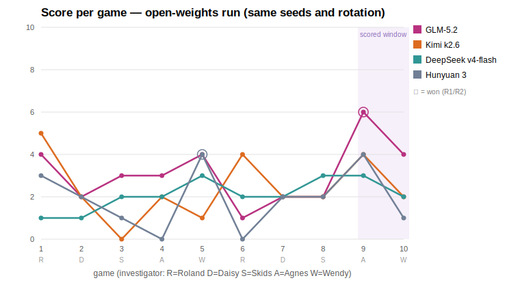

| Agent (harness) | Scores by game | Mean | **Final-20%** | Wins |
|---|---|---:|---:|---|
| GLM-5.2 (opencode) | 4 2 3 3 4 1 2 2 **6** 4 | 3.10 | **5.00** | R1 g9 |
| Kimi k2.6 (opencode) | 5 2 0 2 1 4 2 2 **4** 2 | 2.40 | **3.00** | — |
| DeepSeek v4-flash (opencode) | 1 1 2 2 3 2 2 3 **3** 2 | 2.10 | **2.50** | — |
| Hunyuan 3 (opencode) | 3 2 1 0 4 0 2 2 **4** 1 | 1.90 | **2.50** | R1 g5 |

**US/China reading.** On the headline final-20% metric the combined board runs:
Fable 5 (6.50) > Sonnet 5 (5.50) > **GLM-5.2 (5.00)** > GPT-5.5 (4.00) > Opus 4.8
(3.50) > Kimi k2.6 (3.00) > DeepSeek v4-flash = Hunyuan 3 (2.50). GLM-5.2 is the
open-weights standout — third overall, ahead of two US frontier closed models —
and repeated the familiar pattern of converting a notebook-informed game-9 win.
Hunyuan 3 (free tier) won a game outright on cold start. DeepSeek v4-flash never
scored below 1 or above 3: the most consistent and least explosive agent we have
benched. All four open models played materially shorter games than the US four
(66–83 decisions/game vs 98–104), mostly reflecting earlier deaths.

### Game length vs score

Steps = decisions faced before the game ended (winning takes longer than dying):

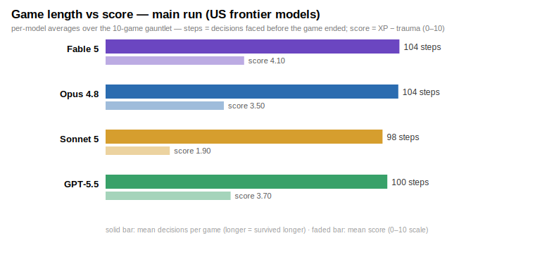
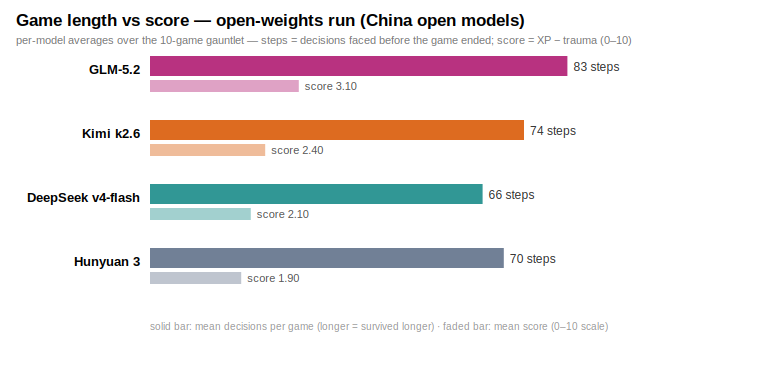

### Case study: memory curation is the continual-learning bottleneck (hy3-b3, 2026-07-09)

A viewer review caught Hunyuan 3's game-6 Roland repeating game-1's exact death:
at "discard 1 random card OR take 2 horror" it chose the horror that had already
killed it once. The autopsy cleared the harness — hy3 read its notebook every
game, and its game-1 notes contained the verbatim fix ("KEY FIX for next Roland
game: take DISCARD not 2horror"). The lesson died in game 2, when hy3's
`note compact` rewrote the notebook and silently dropped every Roland line. An
A/B probe on the reconstructed decision was 15/15 clean: with the notebook it
actually saw, hy3 repeats the fatal choice 5/5; with the lost lesson restored
(or a blunt "you died to this" hint) it flips to discard 5/5. **The model uses
memories fine; it destroys them at curation time.**

So we changed the contract, not the model: `note compact` now documents that
compact means *compress, not discard* (help text + mission guidance to carry
per-investigator lessons forward), prints its line delta, and archives stay
readable via a new `note archive` command. Then we reran the identical 10-game
gauntlet as **hy3-b3** — same seeds, same rotation, engine otherwise unchanged.

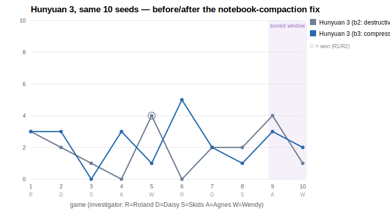

| Run | Scores by game | Mean | Final-20% | Paired 2nd-visit Δ |
|---|---|---:|---:|---:|
| hy3-b2 (destructive compaction) | 3 2 1 0 4 0 2 2 **4** 1 | 1.90 | 2.50 | **−0.40** |
| hy3-b3 (compress-not-discard) | 3 3 0 3 1 5 2 1 **3** 2 | 2.30 | 2.50 | **+0.60** |

What actually changed:

- **The smoking-gun decision flipped.** On seed 1006 (Roland's second game), b3
  chose the discard — `--why: "Roland sanity max 5 is low; discard random card
  over 2 horror to preserve sanity buffer"` — and went from b2's round-4 death
  (score 0) to a 16-round Act-3 fight worth score 5, hy3's best game in either
  run. And the application is *conditional*, not rote: high-sanity investigators
  (Daisy 9, Agnes 8) still rationally take the horror; only low-sanity states
  pick the discard.
- **Compaction preserved memory this time.** b3 compacted twice (100→24 lines at
  its most aggressive) and both times kept per-investigator sections for all
  five investigators — the exact thing b2's compaction destroyed. The archive
  recovery command was never needed.
- **General-strategy mistakes moved less than scores did.** Counting four
  "new-player error" classes across all 10 games (b2 → b3): attacks of
  opportunity provoked 14 → 8, unarmed walk-ins to enemy locations 10 → 7,
  hand-limit discards 11 → 10, last-action draws 3 → 8 (worse). Play got
  meaningfully safer around enemies, but this is refinement, not transformation
  — an AoO still contributed to a b3 death in game 7.
- **Caveats:** one 10-game run per condition; the final-20% headline tied at
  2.50; b3's games 3–5 straddled a 9-hour free-tier quota freeze. The mean and
  paired-delta gains are suggestive, the seed-1006 flip is definitive evidence
  of recipe learning, and the compaction-behavior change is directly observable
  in the notebook history.

The meta-lesson for continual-learning harnesses: **retrieval and reasoning were
never the problem — memory management was.** A one-line semantic contract on the
compaction tool ("compress, not discard") converted a memory-destroying agent
into a memory-preserving one.

## Benchmark results — Kimi K3 (2026-07-16, launch day)

The identical gauntlet, run the day Moonshot's Kimi K3 reached OpenRouter —
through upstream 429 storms that stalled the lane for hours mid-run (the
watchdog-and-resume harness rode it out; three games banked before the outage,
seven after). Engine caveat: ~23 rules fixes newer than b4's engine.

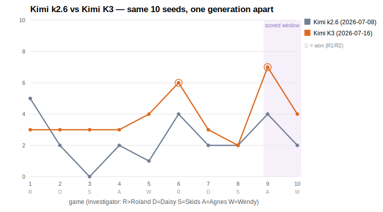

| Agent (harness) | Scores by game | Mean | **Final-20%** | Wins |
|---|---|---:|---:|---|
| Kimi K3 (opencode) | 3 3 3 3 4 6 3 2 **7** 4 | 3.80 | **5.50** | R2 g6, R2 g9 |
| *Kimi k2.6 (b2, for reference)* | 5 2 0 2 1 4 2 2 4 2 | 2.40 | 3.00 | — |

**The best open-weights result on the board.** K3's final-20% of 5.50 **ties
Sonnet 5 for second overall** (behind only Fable 5's 6.50), ahead of GLM-5.2
(5.00) and GPT-5.6 Sol (4.50). Its 3.80 mean is second all-time behind Fable's
4.10 — with the lowest variance of any high scorer (never below 2). The
generational jump over k2.6 (+1.40 mean, +2.50 final-20%) is the largest
single-generation improvement we've measured, with the standard caveat that the
two ran on different engine versions. Its game-9 R2 win (score 7) is the
familiar signature of a notebook-informed conversion in the scored window.

Combined final-20% board: Fable 5 (6.50) > **Sonnet 5 = Kimi K3 (5.50)** >
GLM-5.2 (5.00) > GPT-5.6 Sol (4.50) > GPT-5.5 (4.00) > Opus 4.8 (3.50) >
Kimi k2.6 = GPT-5.6 Terra = GPT-5.6 Luna (3.00) > DeepSeek v4-flash =
Hunyuan 3 (2.50).

## Wave 6 — Kimi K3 in the judge's chair (2026-07-18/19)

Three days after its launch-day gauntlet, K3 got the other job: **auditor**.
Three models — Hunyuan 3, GPT-5.6 Luna, and Sonnet 5 — each played five full
Return to Night of the Zealot campaigns in parallel lanes (seeds 9401–9405,
matched to the b4 wave; fresh per-model notebooks shared across each model's
five campaigns), and Kimi K3 audited **all sixty artifacts**: every scenario
transcript and every campaign ledger. Fable verified or refuted every finding
(adversarial sub-verifiers, printed-card and ArkhamDB ground truth, primary-
source campaign-guide reads); GPT-5.6 Sol implemented every confirmed fix.

### The campaigns

| Model | R | D | S | A | W | Total | prior total |
|---|---:|---:|---:|---:|---:|---:|---|
| GPT-5.6 Luna | 7\* | 3 | 0 | 3 | 2 | **15** | 16 (b4, same seeds) |
| Sonnet 5 | 4 | 3 | 2 | 3 | 2 | **14** | — (first campaigns) |
| Hunyuan 3 | 5 | 2 | 1 | 3 | 2 | **13** | 7 (b3 wave, seeds 93xx) |

A three-point spread across three very different models — and hy3 nearly
doubled its previous campaign total under the same compress-not-discard
notebook rules. Zero finale survivals continues: 0-for-45 all-time.
\*Luna's Roland leg 1 carries an attribution asterisk: a residual pointer race
(ledger 154, now fixed) let Sonnet's agent play several of its rounds — both
models' notebooks independently documented the incident, which is its own
kind of benchmark result.

### The audit trial

**K3 filed 40 findings: 23 confirmed, 17 refuted (57.5% precision).** The
confirmed set collapses to 22 distinct defects — more than any auditor tier
in any prior wave — including two exploits (Lita Chantler never occupied her
ally slot; Dissonant Voices' "cannot play events" unenforced in seven special
windows), three material-outcome bugs (a hardcoded Ghoul Priest spawn that
saved Daisy's life; clues destroyed when placed on unrevealed locations,
which made one game unwinnable; a pending-damage clobber that moved a defeat
boundary), and a regression of an adjudicated fix that unit tests missed
because the call site — not the function — had been severed.

The refutations are as instructive as the finds. Six were the transcript's
fault: the engine was right but the log couldn't prove it (unsourced doom
lines, missing instance ids, silent Lita placement, invisible purchases) —
each became an adopted logging improvement, so the audit surface is
permanently better. Two were fabricated facts (an "Arcane Studies (4)" that
doesn't exist; a misquoted status line), one was overruled by the printed
campaign guide itself (Midnight Masks defeats *do* read Resolution 1), and
one repeated an already-refuted misread. A Sol counter-audit of six
K3-cleared games corroborated five and caught one missed display defect.

Auditor board (confirmed/claims): GPT-5.6 Sol 18/21 (86%) · Fable 5 6/8 ·
GPT-5.5 5/8 · **Kimi K3 23/40 (58%)** · Hunyuan 3 3/70 (4%). Twelve fix
batches (14–25) shipped from this wave; the suite grew from 360 to 429
tests; the adjudication ledger stands at 155 entries with its eighth
reversal — this one of the gate's own ruling, caught by Sol's spec-conflict
flag and settled by the ArkhamDB dump.

All fifteen campaigns are browsable in the [viewer](https://clydeiii.github.io/arkhambench/)
(model groups "— w6"), and the findings page carries the full trial.

## Benchmark results — GPT-5.6 family (2026-07-10, release day +1)

The identical 10-game gauntlet (seeds 1001–1010, same rotation, empty starting
notebooks, confirmations off), run for all three GPT-5.6 tiers via codex within
24 hours of their public release. Engine caveat: these ran post-batch-12 (19
rules fixes newer than the b2 engine, ~50 newer than b1) — cross-table
comparisons remain indicative, not controlled.

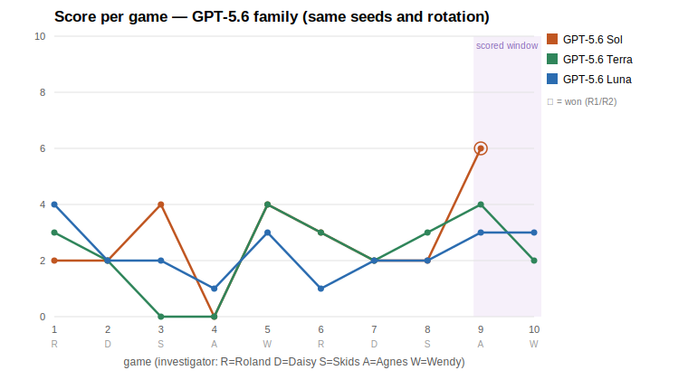

| Agent (harness) | Scores by game | Mean | **Final-20%** | Wins |
|---|---|---:|---:|---|
| GPT-5.6 Sol (codex) | 2 2 4 0 4 3 2 2 **6** 3 | 2.80 | **4.50** | R1 g9 |
| GPT-5.6 Terra (codex) | 3 2 0 0 4 3 2 3 **4** 2 | 2.30 | **3.00** | — |
| GPT-5.6 Luna (codex) | 4 2 2 1 3 1 2 2 **3** 3 | 2.30 | **3.00** | — |

Readings:

- **Sol beats its predecessor** — final-20% 4.50 vs GPT-5.5's 4.00 — and its
  game-9 R1 win (Agnes, 10 rounds) is the shape this benchmark rewards: a
  notebook-informed conversion in the scored window. But it lands **fourth** on
  the combined board, behind Fable 5 (6.50), Sonnet 5 (5.50), and GLM-5.2
  (5.00).
- **Terra and Luna are indistinguishable here** (identical means, identical
  final-20%) despite a 2.5× price gap — on this benchmark, Luna is the value
  play, echoing its strong showing in the realistic-deck playtest wave.
- **No 5.6 tier showed a hot cold-start.** GPT-5.5's famous game-1 score of 9
  has no analog: the family's best opener was Luna's 4. Steadier, less
  explosive.
- Combined final-20% board: Fable 5 (6.50) > Sonnet 5 (5.50) > GLM-5.2 (5.00) >
  **Sol (4.50)** > GPT-5.5 (4.00) > Opus 4.8 (3.50) > Kimi k2.6 = **Terra** =
  **Luna** (3.00) > DeepSeek v4-flash = Hunyuan 3 (2.50).

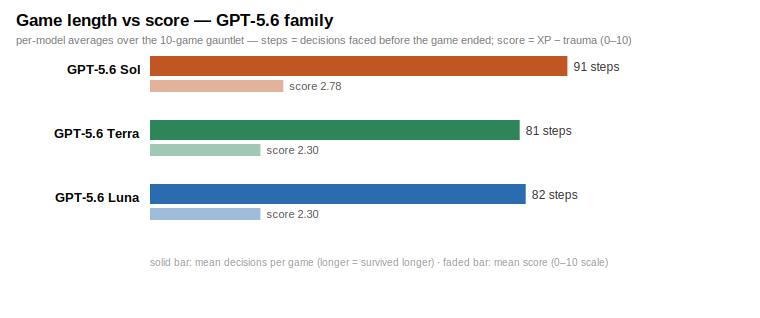

### Campaign learning: five campaigns, one notebook (2026-07-10)

Six models each played five full three-scenario campaigns in sequence with one
persistent notebook shared across all five — cross-campaign learning as the
explicit test. Campaign score = sum of leg scores, listed in the order actually
played:

| Model | Arc (chronological) | Total | Shape |
|---|---|---:|---|
| Fable 5 | 4 2 4 **8** 6 | 24 | late surge |
| GPT-5.5 | 2 **7** 4 0 7 | 20 | volatile |
| GPT-5.6 Luna | 1 3 4 **6** 2 | 16 | rise, late stumble |
| GPT-5.6 Terra | 3 3 2 3 2 | 13 | flat |
| GPT-5.6 Sol | 0 **4** 3 2 3 | 12 | early jump, plateau |
| Hunyuan 3 | 1 1 0 2 **3** | 7 | gentle rise |

**Correction (2026-07-11, ledger 112):** the campaign-lane pointer race (ledger
108) had let six legs across five GPT-5.6 campaigns record *other lanes'* games
before it was fixed. A cross-campaign audit sweep caught it; the five campaigns
were quarantined and fully replayed on the fixed engine (same seeds; replays are
the chronologically last entries in each arc, played with the model's evolved
notebook). The table above is the corrected record — an earlier revision of this
section reported partially-contaminated arcs.

Two readings. First, the 5.6 tiers now separate — Luna leads the family at 16
with the most learning-shaped arc, and Sol's flagship pedigree doesn't transfer
to campaign play (12). Second, the sobering constant survived the correction:
**all 30 campaigns ended with the investigator dead in The Devourer Below.**
Zero finale survivals, zero Umôrdhoth repels, at every capability tier from
Haiku-class to flagship. Whatever the campaign finale demands — multi-scenario
resource husbandry, trauma management, a finishing plan held across three
scenarios — no current model has it.

**Interactive findings page:** all of the above, with every game linked to its
full replay — https://clydeiii.github.io/arkhambench/results.html

### The second benchmark: can models playtest?

While building this we found the bounty structure turns the benchmark self-healing:
agents are told verified engine-bug reports (via `./ahlcg bug`) are worth more than
score, making every adversary an auditor. Across two live hunts and two
transcript-audit passes (cheap model plays, strong model audits the log), agents
filed 24+ adjudicated reports; **21 confirmed engine defects were found and fixed**
before this benchmark ran — including an engine-wide double-execution bug that unit
tests, 200-game fuzzing, and human review all missed. Game skill and playtest skill
turn out to be distinct: the best bug-finder (Fable 5, 6 confirmed finds) and the
best cold-start player (GPT-5.5) are different models. Full verdicts:
[`specs/bug_adjudications.md`](specs/bug_adjudications.md).

**The GPT-5.6 audit wave (2026-07-10)** scaled this up on release day+1: 28
playtest games (Haiku 4.5 driving deliberately-unplayable "coverage decks" packed
with all 32 XP cards, plus GPT-5.6 Luna/Terra playing decks upgraded the way real
campaigns upgraded them), then GPT-5.6 Sol audited every transcript. Sol raised 34
findings; adversarial verification (three parallel checker agents + a final human-
tier gate) confirmed **18 unique engine defects — 86% auditor precision**, against
Hunyuan 3's 0/5 the same week. All 18 were fixed as batch 12 (ledger 86–105) with
per-defect regression tests. The wave also completed a 32/32 XP-card coverage
disposition: 19 cards exercised in live agent play, 13 covered by deterministic
probe tests — and the very last never-played card (Cat Burglar) was hiding defect
107 in its probe. Auditor tier matters more than driver tier: the drivers in this
wave found almost nothing themselves; the auditor found everything.

Card data © Fantasy Flight Games, via the community project
[arkhamdb-json-data](https://github.com/Kamalisk/arkhamdb-json-data). This project is for
AI-capabilities research and commentary; it does not distribute scans of the game.
